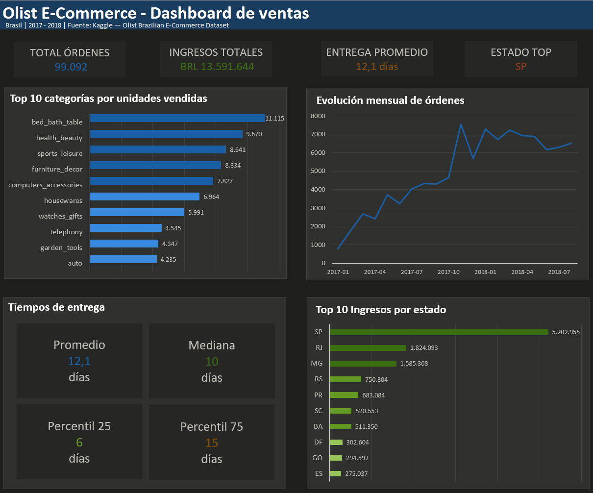

# Análisis de E-Commerce Olist


Análisis exploratorio de datos (EDA) sobre el dataset público de e-commerce brasileño de Olist, con el objetivo de identificar patrones de ventas, comportamiento logístico y distribución geográfica de ingresos. Incluye pipeline de datos automatizado, visualizaciones en Python y un dashboard ejecutivo en Excel.

---

## Estructura del repositorio

```
analisis-de-ventas/
│
├── notebooks/
│   └── 01_eda.ipynb              # EDA completo con análisis y visualizaciones
├── dashboard/
│   ├── dashboard.xlsx            # Dashboard ejecutivo en Excel
│   └── dashboard_preview.png     # Captura del dashboard
├── setup.py                      # Script de setup automatizado (descarga + carga a SQLite)
├── pyproject.toml                # Dependencias del proyecto
├── poetry.lock                   # Versiones exactas de las dependencias
├── LICENSE
└── README.md
```

---

## ¿Qué contiene este proyecto?

### 1. Pipeline de datos (`setup.py`)
- Descarga automática del dataset desde Kaggle via API
- Carga de los 9 archivos CSV a una base de datos SQLite
- Genera `olist.db` listo para ser consultado desde el notebook

### 2. Análisis exploratorio (EDA: `notebooks/01_eda.ipynb`)
- Ranking de categorías por volumen de ventas
- Análisis de tiempos de entrega con distribución estadística
- Evolución temporal de órdenes para detectar estacionalidad
- Distribución de ingresos por estado

### 3. Visualizaciones
- Gráficos de barras, líneas y distribuciones con matplotlib y seaborn
- Exportación de datos agregados a Excel como fuente del dashboard

### 4. Dashboard en Excel (`dashboard/dashboard.xlsx`)
- Vista ejecutiva con KPIs, gráficos y ranking de estados y categorías



---

## Hallazgos principales

- **Categorías líderes:** Las categorías de **cama/baño/mesa**, **salud/belleza** y **deportes/ocio** lideran las ventas, concentrando una proporción significativa del volumen total. Esto muestra que Olist tiene una base de clientes orientada al hogar y el bienestar personal.
- **Tiempos de entrega:** El tiempo promedio de entrega es de **12 días**, con una mediana de **10 días**. Hay algunos outliers que superan los 60 días. Para un e-commerce, 10-12 días es un tiempo elevado comparado con estándares internacionales. Esto podría significar que existe una oportunidad de mejora logística.
- **Crecimiento y estacionalidad:** Las ventas crecieron de forma sostenida durante 2017 con un pico en noviembre (Black Friday), para luego estabilizarse en torno a las 6.000–7.000 órdenes mensuales en 2018. La plataforma pasó de una fase de expansión a una de madurez.
- **Concentración geográfica:** **São Paulo concentra más del doble de ingresos** que el segundo estado (Río de Janeiro), seguido por Minas Gerais. Esto refleja la concentración económica histórica de Brasil.

---

## Tecnologías y requisitos

| Herramienta | Uso |
|---|---|
| Python 3.12 | Análisis, visualización y pipeline de datos |
| pandas | Manipulación y agregación del dataset |
| matplotlib / seaborn | Visualizaciones exploratorias |
| Jupyter Notebook | Entorno de desarrollo |
| Excel | Dashboard ejecutivo |
| SQLite | Base de datos local generada desde los CSVs |
| Poetry | Gestión del entorno virtual y dependencias |

---

## Cómo ejecutar el proyecto

### Requisitos previos

- Python 3.12
- Poetry
- Cuenta de Kaggle con API key

### Instalación

1. Clonar el repositorio:
```bash
git clone https://github.com/JackyDye/analisis-de-ventas
cd analisis-de-ventas
```

2. Instalar dependencias:
```bash
poetry install
```

3. Activar el entorno virtual:
```bash
Invoke-Expression (poetry env activate)
```

4. Colocar el archivo `kaggle.json` en la raíz del proyecto.

5. Ejecutar el script de setup:
```bash
python setup.py
```
Esto descarga automáticamente el dataset desde Kaggle y crea la base de datos SQLite con las 9 tablas. Posteriormente, los dataset se eliminan para liberar espacio.

6. Abrir el notebook:
```bash
jupyter notebook notebooks/01_eda.ipynb
```

---

## Créditos

Dataset original: [Brazilian E-Commerce Public Dataset by Olist](https://www.kaggle.com/datasets/olistbr/brazilian-ecommerce)

## 👤 Autor

**JackyDye**  
[GitHub](https://github.com/JackyDye) · [LinkedIn](https://www.linkedin.com/in/augusto-valles/)
